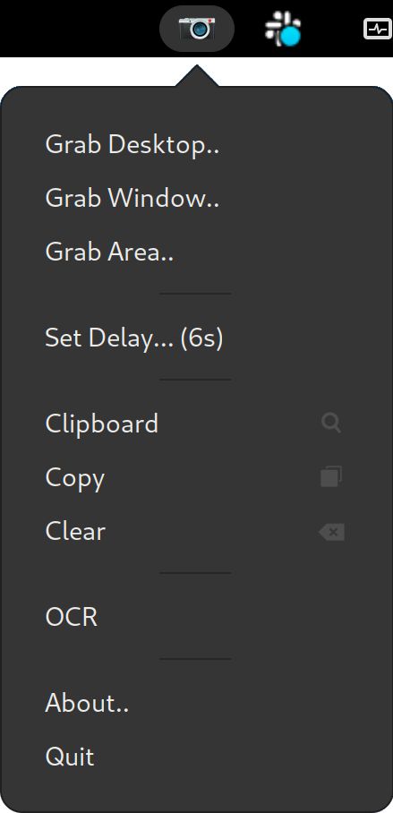
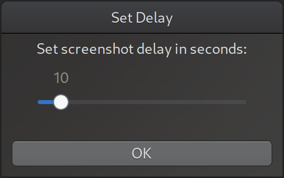

# snappo
### A Screen Snapshot tool with OCR capabilities
Snappo stand for **SN**apshot **APP**licati**O**n. It is a useful tool to take snapshots of windows,
areas of the screen, or the entire desktop in the system clipboard, for quick copy & paste exchanges
with other applications. What makes Snappo different is the possibility to apply bar code recognition
or OCR on the clipboard snapshot content: if the decoding or OCR will be successful, the clipboard
will be set with the decoded or recognized text, leaving you with the possibility to easily paste it 
elsewhere.  

Snappo is written in python using the pygtk library, and relies on gnome to function. The GUI is 
designed as a frontend to a shell script that leverages a few commands to work its magic.

### Dependencies
**Linux**  
*Binaries*:  
`tesseract` (optical character recognition)  
`zbarimg` (bar codes decoding)   
`xclip`  (X Window clipboard for images)  
`xsel` (Insert text into X Window Clipboard)   
`xdotool`  (Select a window and give it focus)  
`eog`  (Visualize grabbed imaged)  
`gnome-screenshot` (grab the graphic data from the screen)  
*Python*  
`PyGObject` (Python Gtk Object bindings library)

### Installation

##### Fedora
`$ sudo dnf install python3-gobject gtk3`  
`$ sudo dnf install tesseract zbar xclip xsel xdotool eog gnome-screenshot`  

##### Ubuntu
`$ sudo apt update`  
`$ sudo apt install python3-gi python3-gi-cairo gir1.2-gtk-3.0`  
`$ sudo apt install tesseract-ocr zbar-tools xclip xsel xdotool eog gnome-screenshot`  

In case of problems, more information about the installation of the python Gtk Object binding can be found [here](https://pygobject.readthedocs.io/en/latest/getting_started.html)

**MacOS**  
(Coming soon)

### Usage

  

The usage is pretty straightforward. When started, an icon with a camera will appear in the gnome top menu bar.
From this you can show the popup menu with some options:

* **Grab Desktop**..  
  Clicling on this the whole desktop (including multiple screens) will be snapshot into the clipboard.
* **Grab Window**..  
  Running under gnome/x11, this will show a selector with which you can choose a window to snap. Under wayland you 
  need to select the window you want first, then select this menu voice to snap it.
* **Grab Area**..  
  This option will show a selector with which you can select a rectangular area on the screen to snap into the
  clipboard.
* **Set Delay**..  
  This will open a small dialog in which you can put a delay before doing the snapshot. It is useful if you need to 
  arrange the screen before the snap could be taken.
* **Clipboard**.. 🚫 | 🔍  
  This menu shows a 🚫 symbol when the clipboard is empty, and a 🔍 when it contains a snapshot image. By selecting it 
  the content will be shown in the image viewer.
* **Copy** ⎘  
  This menu lets you reinsert the snapshot image in the clipboard, in case it was accidentally lost.
* **Clear** ⌫  
  This menu lets you erase the snapshot image from the clipboard and the persisted temporary file.
* **OCR**  
  By selecting this, Snappo will perform a barcode detection on the snapped image, decode it and put the resulting text
  in the clipboard. If the barcode detection is unsuccessful, an optical character recognition will be performed, and 
  the resulting text copied in the clipboard. The barcodes recognized are the ones supported by the zbar package, and 
  the OCR is performed by the open source package tesseract.
* **Quit**  
  Exits from Snappo and cleans up resources.